# Diagramas de Arquitectura - Amigusto
## Visualizaciones de Flujos y Arquitectura del Sistema

> Estos diagramas utilizan Mermaid syntax, que se renderiza automáticamente en GitHub, GitLab y muchas otras plataformas.

---

## 1. ARQUITECTURA GENERAL DEL SISTEMA

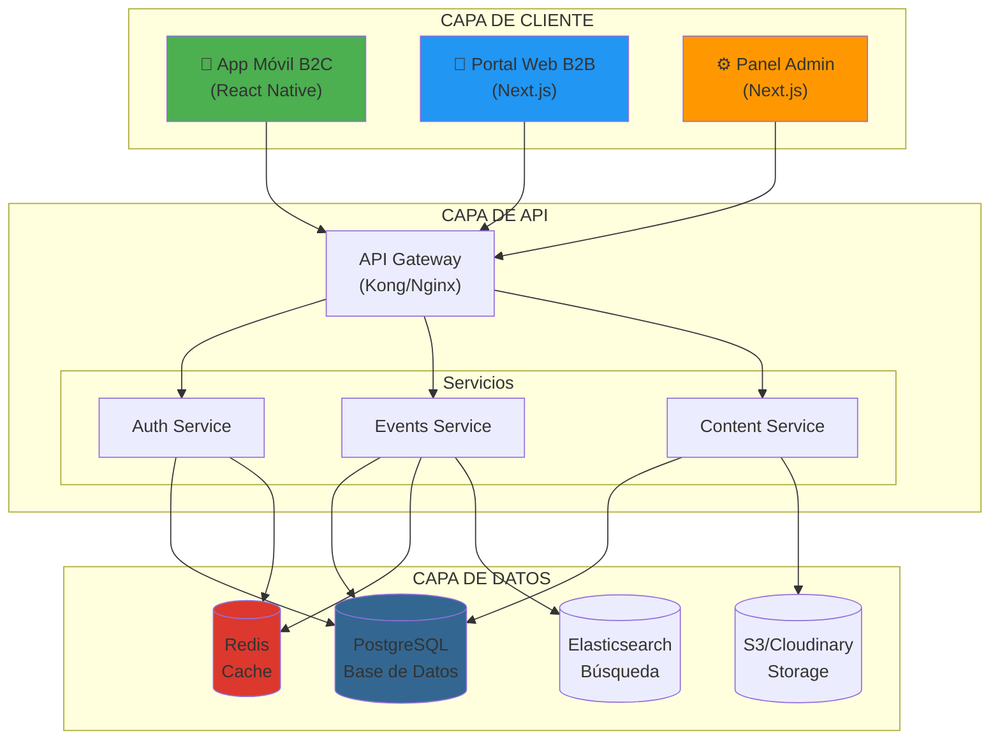

---

## 2. FLUJO DE CURACIÓN DE EVENTOS (LA "SALSA SECRETA")

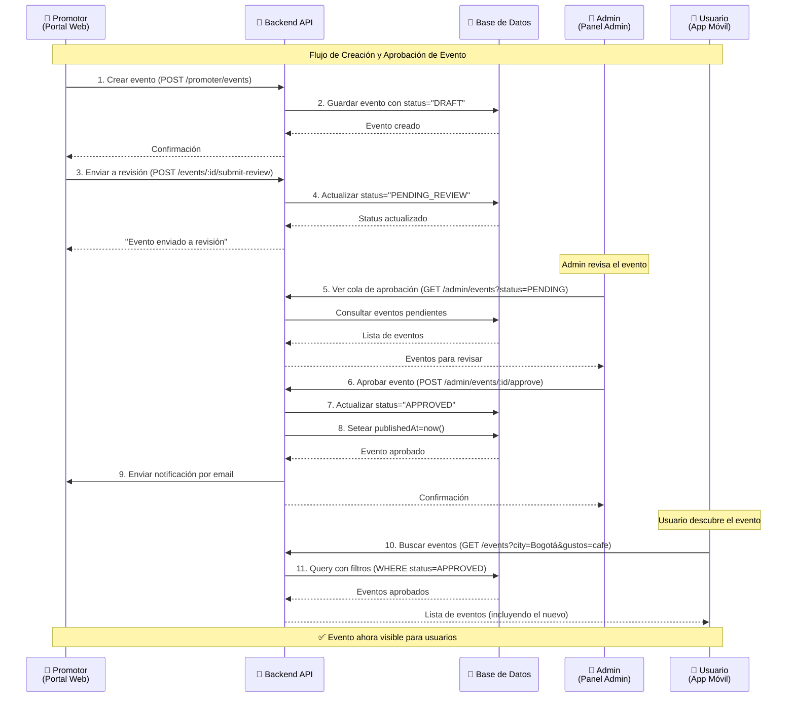

---

## 3. FLUJO DE USUARIO EN LA APP MÓVIL

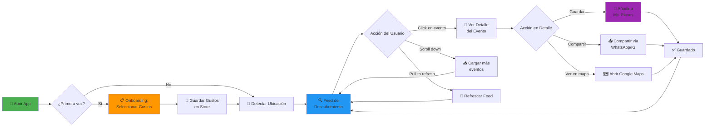

---

## 4. MODELO DE DATOS (ENTIDAD-RELACIÓN SIMPLIFICADO)

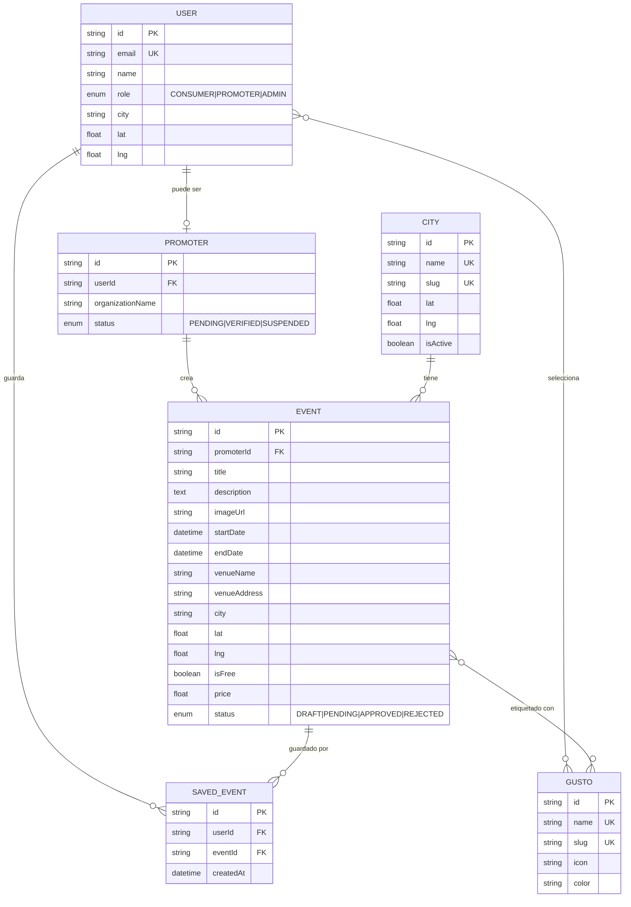

---

## 5. ESTADOS DE UN EVENTO (STATE MACHINE)

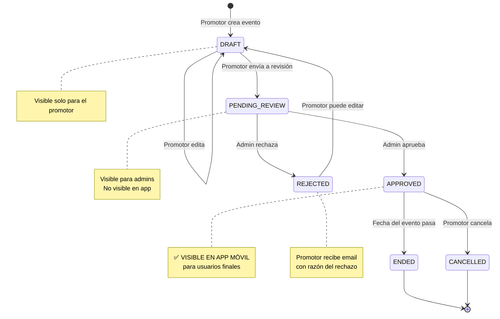

---

## 6. ARQUITECTURA DE AUTENTICACIÓN

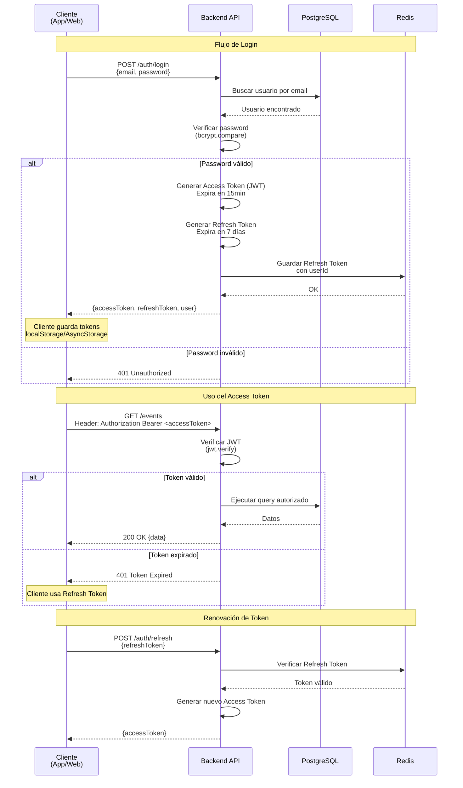

---

## 7. FLUJO DE BÚSQUEDA GEOESPACIAL

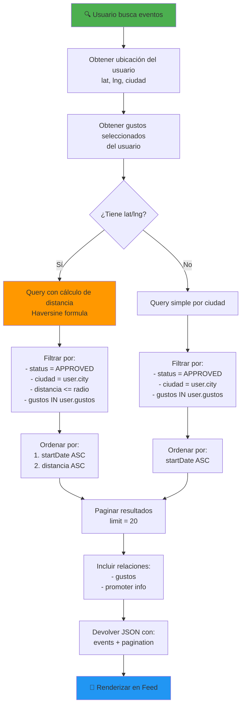

---

## 8. PIPELINE DE CI/CD

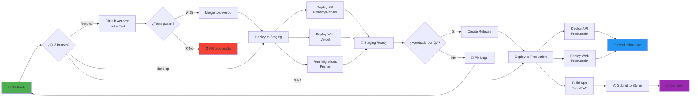

---

## 9. ARQUITECTURA DE MONOREPO (TURBOREPO)

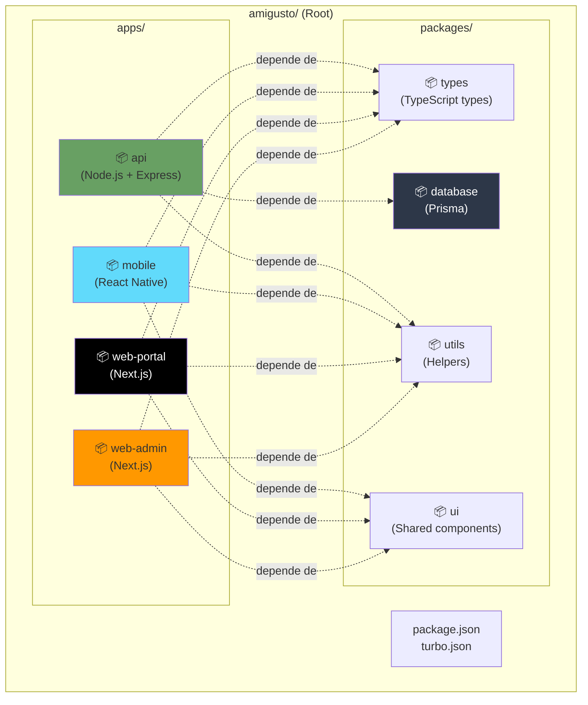

---

## 10. ESCALAMIENTO PROGRESIVO

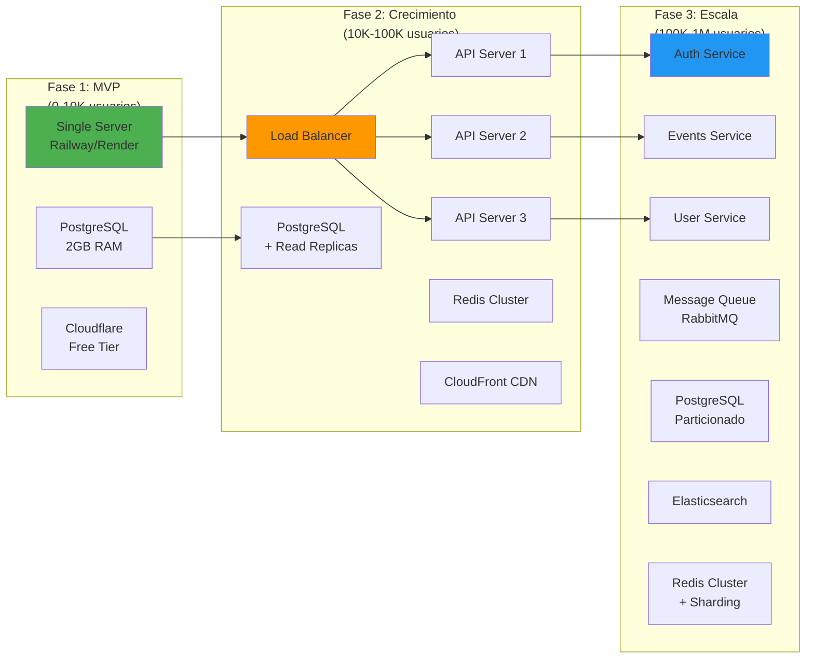

---

## 11. FLUJO DE ONBOARDING DE USUARIO

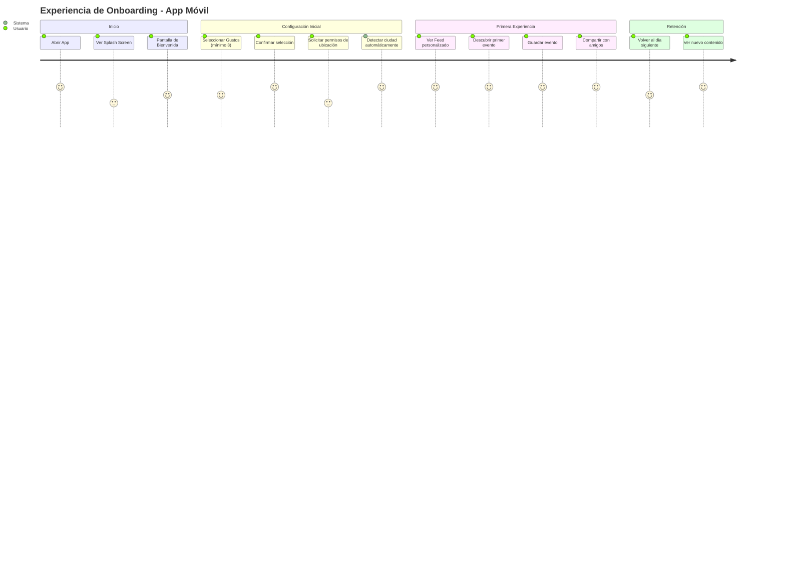

---

## 12. MÉTRICAS Y OBSERVABILIDAD

```mermaid
graph TB
    subgraph "Aplicaciones"
        App["📱 Apps"]
        API["🔧 API"]
        DB["💾 BD"]
    end

    subgraph "Recolección"
        Logs["📝 Logs<br/>(Winston)"]
        Metrics["📊 Metrics<br/>(Prometheus)"]
        Traces["🔍 Traces<br/>(Sentry)"]
        Analytics["📈 Analytics<br/>(Firebase/Mixpanel)"]
    end

    subgraph "Visualización"
        Grafana["📊 Grafana<br/>Dashboards"]
        Sentry["🐛 Sentry<br/>Error Tracking"]
        Mixpanel["📈 Mixpanel<br/>Product Analytics"]
    end

    subgraph "Alertas"
        Slack["💬 Slack"]
        Email["📧 Email"]
        PagerDuty["📞 PagerDuty"]
    end

    App --> Logs
    App --> Analytics
    API --> Logs
    API --> Metrics
    API --> Traces
    DB --> Metrics

    Logs --> Grafana
    Metrics --> Grafana
    Traces --> Sentry
    Analytics --> Mixpanel

    Grafana -.alerta.-> Slack
    Grafana -.alerta.-> Email
    Sentry -.alerta.-> Slack
    Sentry -.alerta crítica.-> PagerDuty

    style Grafana fill:#F46800
    style Sentry fill:#362D59
    style Mixpanel fill:#7856FF
```

---

## Cómo Usar Estos Diagramas

### En GitHub/GitLab:
Los diagramas Mermaid se renderizan automáticamente en archivos `.md`.

### En Notion:
Copiar el código Mermaid en un bloque de código con tipo `mermaid`.

### En Confluence:
Usar el plugin "Mermaid for Confluence".

### Generar Imágenes:
Usar [Mermaid Live Editor](https://mermaid.live/) para exportar como PNG/SVG.

---

**Nota:** Estos diagramas son representaciones simplificadas. Para detalles completos, consultar [PLAN_TECNICO_AMIGUSTO.md](./PLAN_TECNICO_AMIGUSTO.md).
