# Diagramas de Arquitectura - Amigusto
## Visualizaciones de Flujos y Arquitectura del Sistema

> Estos diagramas utilizan Mermaid syntax, que se renderiza automáticamente en GitHub, GitLab y muchas otras plataformas.

---

## 1. ARQUITECTURA GENERAL DEL SISTEMA

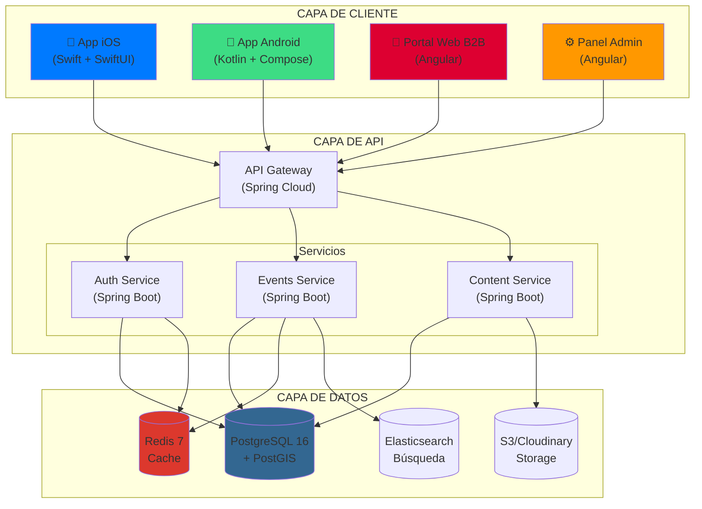

---

## 2. FLUJO DE CURACIÓN DE EVENTOS (LA "SALSA SECRETA")

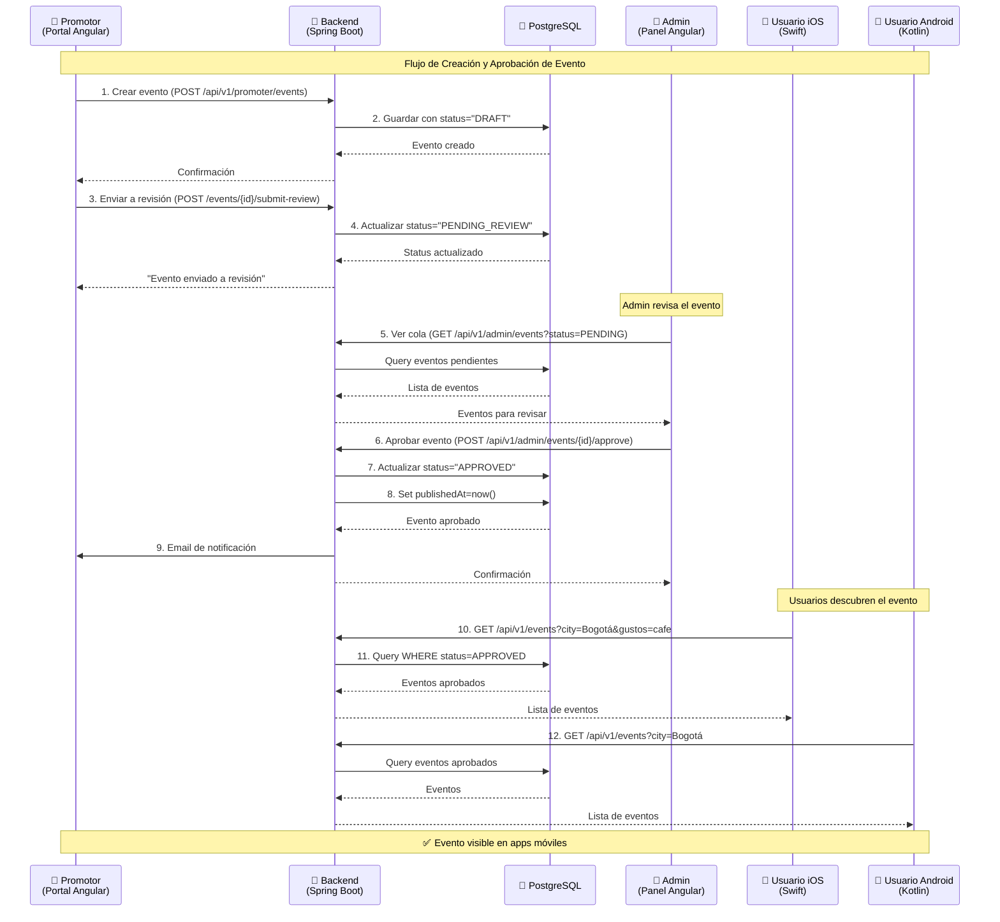

---

## 3. FLUJO DE USUARIO EN LAS APPS MÓVILES

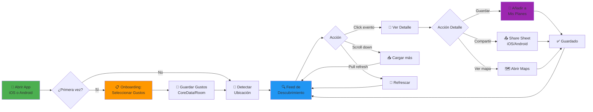

---

## 4. MODELO DE DATOS (ENTITY-RELATIONSHIP)

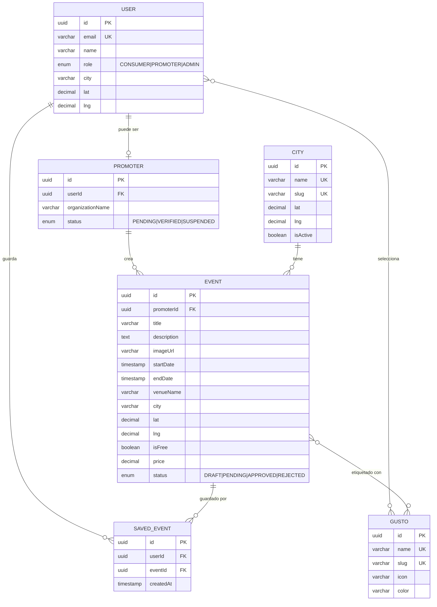

---

## 5. ESTADOS DE UN EVENTO (STATE MACHINE)

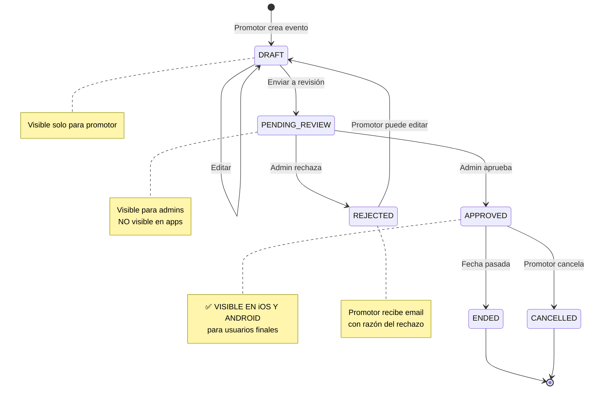

---

## 6. ARQUITECTURA DE AUTENTICACIÓN (SPRING SECURITY + JWT)

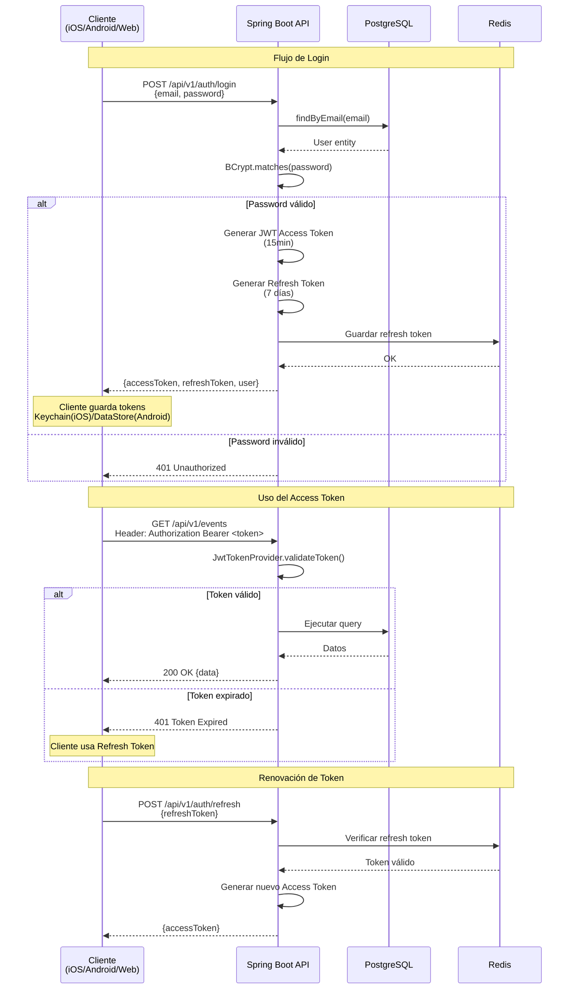

---

## 7. FLUJO DE BÚSQUEDA GEOESPACIAL (POSTGIS)

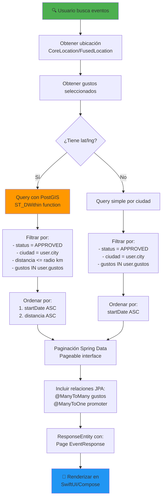

---

## 8. PIPELINE DE CI/CD

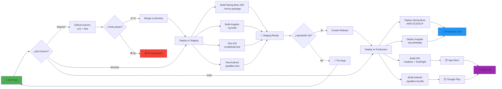

---

## 9. ARQUITECTURA MULTI-REPOSITORIO

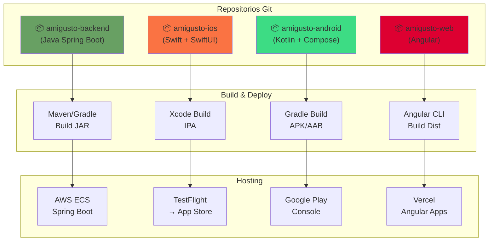

---

## 10. ESCALAMIENTO PROGRESIVO

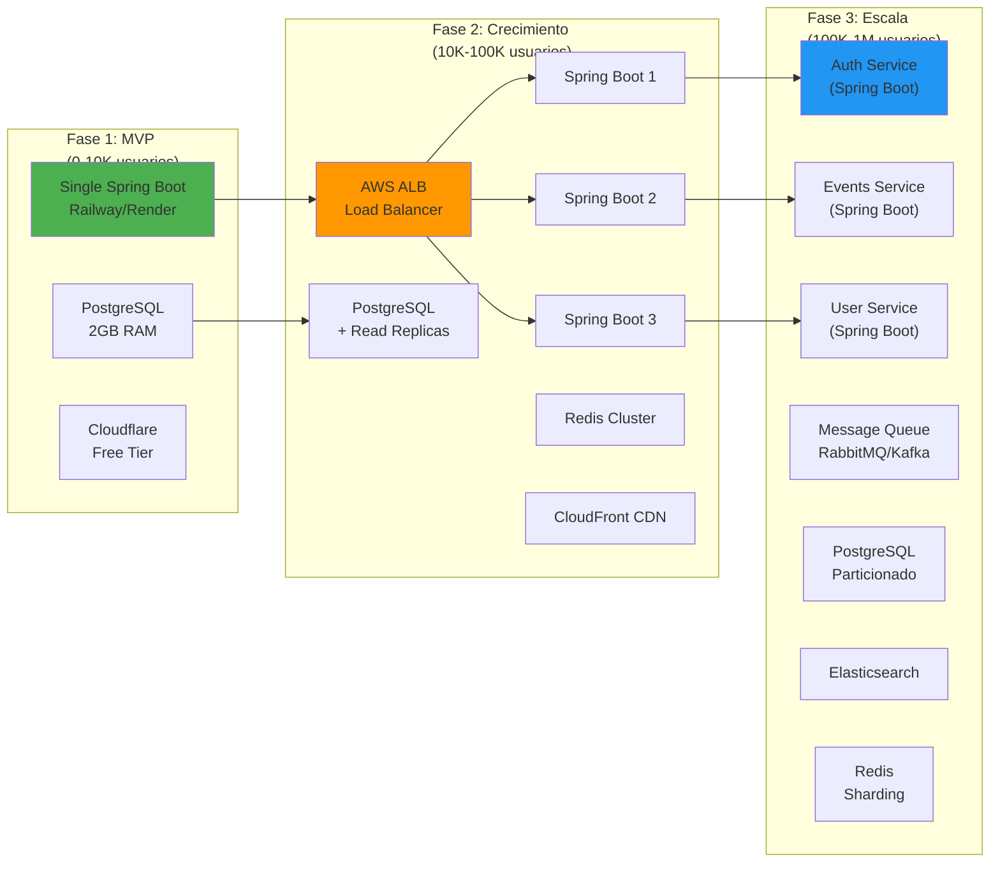

---

## 11. FLUJO DE ONBOARDING EN APPS MÓVILES

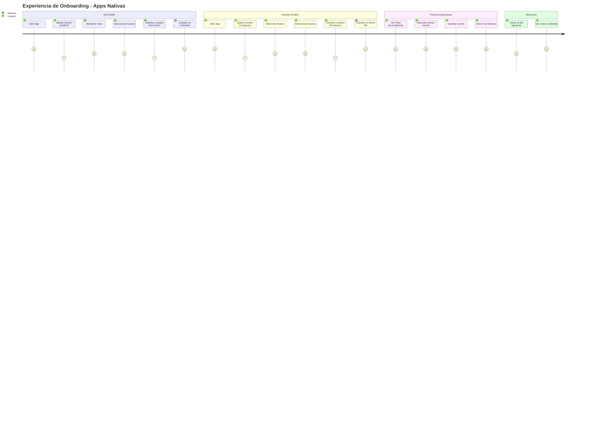

---

## 12. STACK TECNOLÓGICO COMPLETO

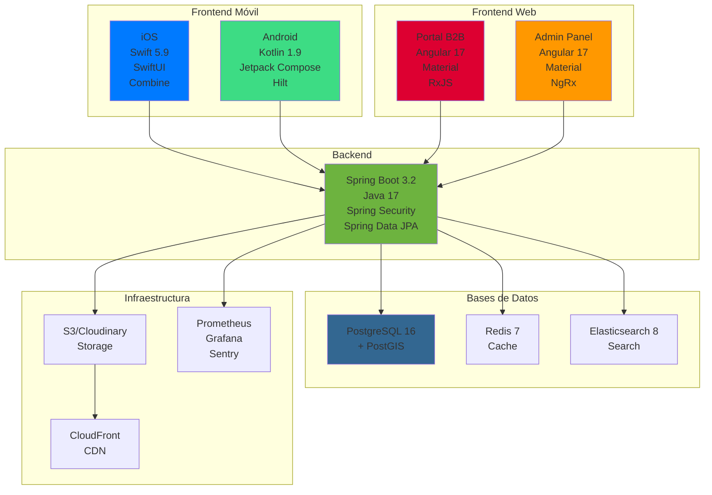

---

## Cómo Usar Estos Diagramas

### En GitHub/GitLab:
Los diagramas Mermaid se renderizan automáticamente en archivos `.md`.

### En Notion:
Copiar el código Mermaid en un bloque de código con tipo `mermaid`.

### En Confluence:
Usar el plugin "Mermaid for Confluence".

### Generar Imágenes:
Usar [Mermaid Live Editor](https://mermaid.live/) para exportar como PNG/SVG.

---

**Nota:** Estos diagramas reflejan la arquitectura actualizada con **Java Spring Boot** (backend), **Swift/SwiftUI** (iOS), **Kotlin/Jetpack Compose** (Android), y **Angular** (web). No hay referencias a tecnologías obsoletas.
