# Diagramas de Arquitectura - Amigusto
## Visualizaciones de Flujos y Arquitectura del Sistema

> Estos diagramas utilizan Mermaid syntax, que se renderiza automáticamente en GitHub, GitLab y muchas otras plataformas.

---

## 1. ARQUITECTURA GENERAL DEL SISTEMA

```mermaid
graph TB
    subgraph "CAPA DE CLIENTE"
        Mobile["📱 App Móvil B2C<br/>(React Native)"]
        Portal["💼 Portal Web B2B<br/>(Next.js)"]
        Admin["⚙️ Panel Admin<br/>(Next.js)"]
    end

    subgraph "CAPA DE API"
        Gateway["API Gateway<br/>(Kong/Nginx)"]

        subgraph "Servicios"
            AuthAPI["Auth Service"]
            EventsAPI["Events Service"]
            ContentAPI["Content Service"]
        end
    end

    subgraph "CAPA DE DATOS"
        Postgres[(PostgreSQL<br/>Base de Datos)]
        Redis[(Redis<br/>Cache)]
        S3[("S3/Cloudinary<br/>Storage")]
        Search[(Elasticsearch<br/>Búsqueda)]
    end

    Mobile --> Gateway
    Portal --> Gateway
    Admin --> Gateway

    Gateway --> AuthAPI
    Gateway --> EventsAPI
    Gateway --> ContentAPI

    AuthAPI --> Postgres
    AuthAPI --> Redis
    EventsAPI --> Postgres
    EventsAPI --> Redis
    EventsAPI --> Search
    ContentAPI --> Postgres
    ContentAPI --> S3

    style Mobile fill:#4CAF50
    style Portal fill:#2196F3
    style Admin fill:#FF9800
    style Postgres fill:#336791
    style Redis fill:#DC382D
```

---

## 2. FLUJO DE CURACIÓN DE EVENTOS (LA "SALSA SECRETA")

```mermaid
sequenceDiagram
    participant P as 🏢 Promotor<br/>(Portal Web)
    participant API as 🔧 Backend API
    participant DB as 💾 Base de Datos
    participant A as 👤 Admin<br/>(Panel Admin)
    participant U as 📱 Usuario<br/>(App Móvil)

    Note over P,U: Flujo de Creación y Aprobación de Evento

    P->>API: 1. Crear evento (POST /promoter/events)
    API->>DB: 2. Guardar evento con status="DRAFT"
    DB-->>API: Evento creado
    API-->>P: Confirmación

    P->>API: 3. Enviar a revisión (POST /events/:id/submit-review)
    API->>DB: 4. Actualizar status="PENDING_REVIEW"
    DB-->>API: Status actualizado
    API-->>P: "Evento enviado a revisión"

    Note over A: Admin revisa el evento

    A->>API: 5. Ver cola de aprobación (GET /admin/events?status=PENDING)
    API->>DB: Consultar eventos pendientes
    DB-->>API: Lista de eventos
    API-->>A: Eventos para revisar

    A->>API: 6. Aprobar evento (POST /admin/events/:id/approve)
    API->>DB: 7. Actualizar status="APPROVED"
    API->>DB: 8. Setear publishedAt=now()
    DB-->>API: Evento aprobado
    API->>P: 9. Enviar notificación por email
    API-->>A: Confirmación

    Note over U: Usuario descubre el evento

    U->>API: 10. Buscar eventos (GET /events?city=Bogotá&gustos=cafe)
    API->>DB: 11. Query con filtros (WHERE status=APPROVED)
    DB-->>API: Eventos aprobados
    API-->>U: Lista de eventos (incluyendo el nuevo)

    Note over P,U: ✅ Evento ahora visible para usuarios
```

---

## 3. FLUJO DE USUARIO EN LA APP MÓVIL

```mermaid
graph LR
    A[🚀 Abrir App] --> B{¿Primera vez?}

    B -->|Sí| C[📋 Onboarding:<br/>Seleccionar Gustos]
    B -->|No| E[📍 Detectar Ubicación]

    C --> D[💾 Guardar Gustos<br/>en Store]
    D --> E

    E --> F[🔍 Feed de<br/>Descubrimiento]

    F --> G{Acción del Usuario}

    G -->|Click en evento| H[📄 Ver Detalle<br/>del Evento]
    G -->|Scroll down| I[📥 Cargar más<br/>eventos]
    G -->|Pull to refresh| J[🔄 Refrescar Feed]

    H --> K{Acción en Detalle}

    K -->|Guardar| L[💾 Añadir a<br/>Mis Planes]
    K -->|Compartir| M[📤 Compartir vía<br/>WhatsApp/IG]
    K -->|Ver en mapa| N[🗺️ Abrir Google Maps]

    L --> O[✅ Guardado]
    M --> O
    N --> O

    O --> F
    I --> F
    J --> F

    style A fill:#4CAF50
    style C fill:#FF9800
    style F fill:#2196F3
    style L fill:#9C27B0
```

---

## 4. MODELO DE DATOS (ENTIDAD-RELACIÓN SIMPLIFICADO)

---

## 5. ESTADOS DE UN EVENTO (STATE MACHINE)

```mermaid
stateDiagram-v2
    [*] --> DRAFT: Promotor crea evento

    DRAFT --> PENDING_REVIEW: Promotor envía a revisión
    DRAFT --> DRAFT: Promotor edita

    PENDING_REVIEW --> APPROVED: Admin aprueba
    PENDING_REVIEW --> REJECTED: Admin rechaza

    REJECTED --> DRAFT: Promotor puede editar

    APPROVED --> ENDED: Fecha del evento pasa
    APPROVED --> CANCELLED: Promotor cancela

    ENDED --> [*]
    CANCELLED --> [*]

    note right of DRAFT
        Visible solo para el promotor
    end note

    note right of PENDING_REVIEW
        Visible para admins
        No visible en app
    end note

    note right of APPROVED
        ✅ VISIBLE EN APP MÓVIL
        para usuarios finales
    end note

    note right of REJECTED
        Promotor recibe email
        con razón del rechazo
    end note
```

---

## 6. ARQUITECTURA DE AUTENTICACIÓN

---

## 7. FLUJO DE BÚSQUEDA GEOESPACIAL

```mermaid
flowchart TD
    A[🔍 Usuario busca eventos] --> B[Obtener ubicación del usuario<br/>lat, lng, ciudad]

    B --> C[Obtener gustos seleccionados<br/>del usuario]

    C --> D{¿Tiene lat/lng?}

    D -->|Sí| E[Query con cálculo de distancia<br/>Haversine formula]
    D -->|No| F[Query simple por ciudad]

    E --> G[Filtrar por:<br/>- status = APPROVED<br/>- ciudad = user.city<br/>- distancia <= radio<br/>- gustos IN user.gustos]

    F --> H[Filtrar por:<br/>- status = APPROVED<br/>- ciudad = user.city<br/>- gustos IN user.gustos]

    G --> I[Ordenar por:<br/>1. startDate ASC<br/>2. distancia ASC]

    H --> J[Ordenar por:<br/>startDate ASC]

    I --> K[Paginar resultados<br/>limit = 20]
    J --> K

    K --> L[Incluir relaciones:<br/>- gustos<br/>- promoter info]

    L --> M[Devolver JSON con:<br/>events + pagination]

    M --> N[📱 Renderizar en Feed]

    style A fill:#4CAF50
    style E fill:#FF9800
    style N fill:#2196F3
```

---

## 8. PIPELINE DE CI/CD

```mermaid
flowchart LR
    A[🔨 Git Push] --> B{¿Qué branch?}

    B -->|feature/*| C[GitHub Actions:<br/>Lint + Test]
    B -->|develop| D[Deploy to Staging]
    B -->|main| E[Deploy to Production]

    C --> F{¿Tests pasan?}

    F -->|✅ Sí| G[Merge to develop]
    F -->|❌ No| H[❌ PR bloqueado]

    G --> D

    D --> I[Deploy API<br/>Railway/Render]
    D --> J[Deploy Web<br/>Vercel]
    D --> K[Run Migrations<br/>Prisma]

    I --> L[🧪 Staging Ready]
    J --> L
    K --> L

    L --> M{¿Aprobado por QA?}

    M -->|Sí| N[Create Release]
    M -->|No| O[🐛 Fix bugs]

    O --> A

    N --> E

    E --> P[Deploy API<br/>Producción]
    E --> Q[Deploy Web<br/>Producción]
    E --> R[Build App<br/>Expo EAS]

    P --> S[🚀 Production Live]
    Q --> S
    R --> T[📦 Submit to Stores]

    T --> U[🎉 App Live]

    style A fill:#4CAF50
    style H fill:#F44336
    style S fill:#2196F3
    style U fill:#9C27B0
```

---

## 9. ARQUITECTURA DE MONOREPO (TURBOREPO)

```mermaid
graph TB
    subgraph "amigusto/ (Root)"
        Root["package.json<br/>turbo.json"]

        subgraph "apps/"
            API["📦 api<br/>(Node.js + Express)"]
            Mobile["📦 mobile<br/>(React Native)"]
            Portal["📦 web-portal<br/>(Next.js)"]
            Admin["📦 web-admin<br/>(Next.js)"]
        end

        subgraph "packages/"
            Types["📦 types<br/>(TypeScript types)"]
            UI["📦 ui<br/>(Shared components)"]
            DB["📦 database<br/>(Prisma)"]
            Utils["📦 utils<br/>(Helpers)"]
        end
    end

    API -.depende de.-> Types
    API -.depende de.-> DB
    API -.depende de.-> Utils

    Mobile -.depende de.-> Types
    Mobile -.depende de.-> UI
    Mobile -.depende de.-> Utils

    Portal -.depende de.-> Types
    Portal -.depende de.-> UI
    Portal -.depende de.-> Utils

    Admin -.depende de.-> Types
    Admin -.depende de.-> UI
    Admin -.depende de.-> Utils

    style API fill:#68A063
    style Mobile fill:#61DAFB
    style Portal fill:#000000,color:#fff
    style Admin fill:#FF9800
    style DB fill:#2D3748,color:#fff
```

---

## 10. ESCALAMIENTO PROGRESIVO

---

## 11. FLUJO DE ONBOARDING DE USUARIO

```mermaid
journey
    title Experiencia de Onboarding - App Móvil
    section Inicio
      Abrir App: 5: Usuario
      Ver Splash Screen: 3: Usuario
      Pantalla de Bienvenida: 4: Usuario
    section Configuración Inicial
      Seleccionar Gustos (mínimo 3): 4: Usuario
      Confirmar selección: 5: Usuario
      Solicitar permisos de ubicación: 3: Usuario
      Detectar ciudad automáticamente: 5: Sistema
    section Primera Experiencia
      Ver Feed personalizado: 5: Usuario
      Descubrir primer evento: 5: Usuario
      Guardar evento: 5: Usuario
      Compartir con amigos: 5: Usuario
    section Retención
      Volver al día siguiente: 4: Usuario
      Ver nuevo contenido: 5: Usuario
```

---

## 12. MÉTRICAS Y OBSERVABILIDAD

```mermaid
graph TB
    subgraph "Aplicaciones"
        App["📱 Apps"]
        API["🔧 API"]
        DB["💾 BD"]
    end

    subgraph "Recolección"
        Logs["📝 Logs<br/>(Winston)"]
        Metrics["📊 Metrics<br/>(Prometheus)"]
        Traces["🔍 Traces<br/>(Sentry)"]
        Analytics["📈 Analytics<br/>(Firebase/Mixpanel)"]
    end

    subgraph "Visualización"
        Grafana["📊 Grafana<br/>Dashboards"]
        Sentry["🐛 Sentry<br/>Error Tracking"]
        Mixpanel["📈 Mixpanel<br/>Product Analytics"]
    end

    subgraph "Alertas"
        Slack["💬 Slack"]
        Email["📧 Email"]
        PagerDuty["📞 PagerDuty"]
    end

    App --> Logs
    App --> Analytics
    API --> Logs
    API --> Metrics
    API --> Traces
    DB --> Metrics

    Logs --> Grafana
    Metrics --> Grafana
    Traces --> Sentry
    Analytics --> Mixpanel

    Grafana -.alerta.-> Slack
    Grafana -.alerta.-> Email
    Sentry -.alerta.-> Slack
    Sentry -.alerta crítica.-> PagerDuty

    style Grafana fill:#F46800
    style Sentry fill:#362D59
    style Mixpanel fill:#7856FF
```

---

## Cómo Usar Estos Diagramas

### En GitHub/GitLab:
Los diagramas Mermaid se renderizan automáticamente en archivos `.md`.

### En Notion:
Copiar el código Mermaid en un bloque de código con tipo `mermaid`.

### En Confluence:
Usar el plugin "Mermaid for Confluence".

### Generar Imágenes:
Usar [Mermaid Live Editor](https://mermaid.live/) para exportar como PNG/SVG.

---

**Nota:** Estos diagramas son representaciones simplificadas. Para detalles completos, consultar [PLAN_TECNICO_AMIGUSTO.md](./PLAN_TECNICO_AMIGUSTO.md).
